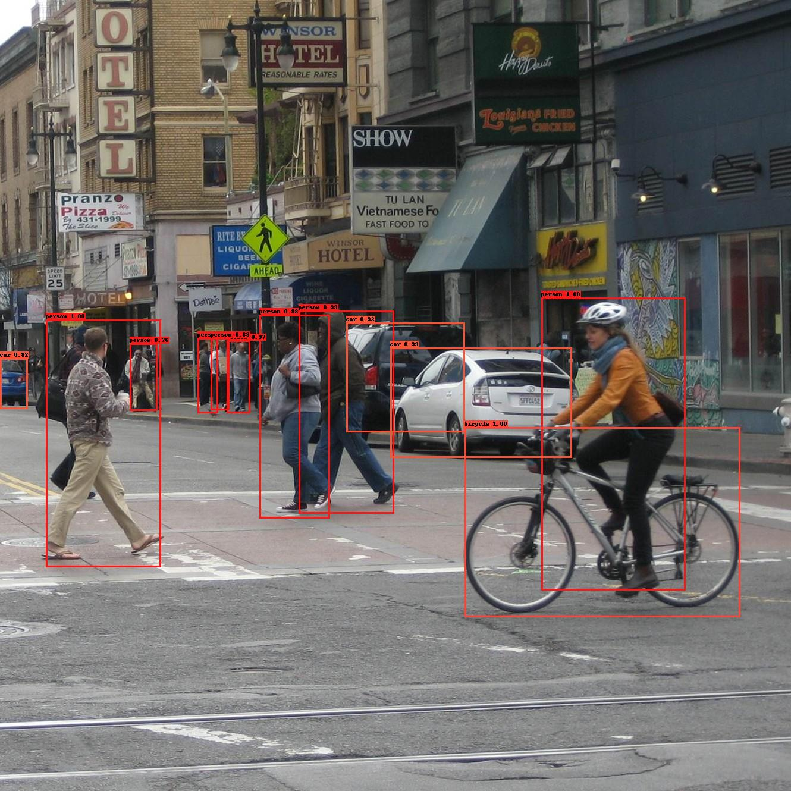

# YOLOV3 Pytorch实现
在[bubbliiing](https://github.com/bubbliiiing/yolo3-pytorch)大佬代码的基础上进行了修改，添加了部分注释。

## 预训练模型
预训练模型来源于bubbliiing。
链接：https://pan.baidu.com/s/1ncREw6Na9ycZptdxiVMApw
提取码：appk

## 训练自己的数据集
+  按照VOC格式准备数据集
   标签文件放在VOCdevkit文件夹下的VOC2007文件夹下的Annotation中。
   图片文件放在VOCdevkit文件夹下的VOC2007文件夹下的JPEGImages中。
+     划分数据集并生成YOLO格式的标签
   在model_data文件夹下新建name_classes.txt文件，用于存放类别信息。修改voc_annotation.py文件下classes_path的指向并运行。生成的数据集划分及标签文件均存放在VOCdevkit\VOC2007\ImageSets\Main文件夹下。
+     开始训练
   将下载好的预训练模型放在model_data文件夹下。修改train.py下的classes_path及model_path指向。运行train.py。

## 测试结果
+ 路径修改
  修改utils/utils_yolo.py文件中的model_path及classes_path，指向训练好的模型参数及类别信息。
+  测试图片
  修改predict_images.py文件下的输入图片路径，直接运行即可完成检测。

## Reference
https://github.com/bubbliiiing/yolo3-pytorch
