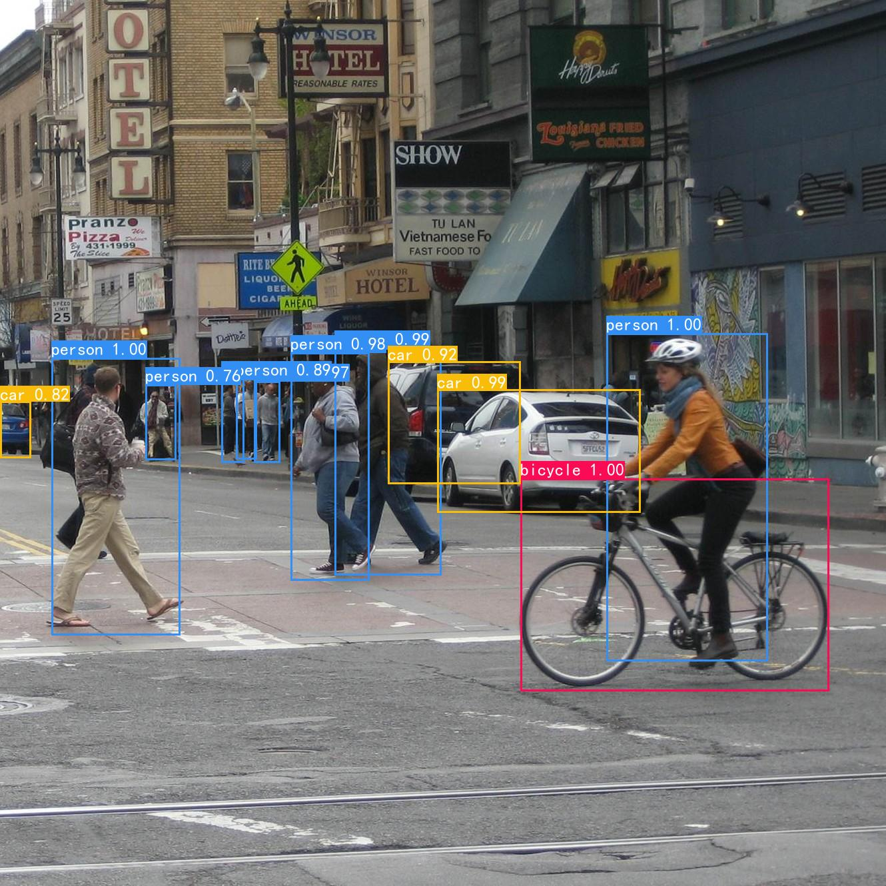

# YOLOV3   pytorch + opencv
在[bubbliiing](https://github.com/bubbliiiing/yolo3-pytorch)大佬代码的基础上进行了修改，添加了部分注释。增加了模型文件.pth格式转.onnx格式，并使用python-opencv读取。
## 图片检测demo
<br>
## 视频检测demo


## 预训练模型
+ .pth格式的预训练模型来源于bubbliiing。<br>
>- 链接：https://pan.baidu.com/s/1ncREw6Na9ycZptdxiVMApw
>- 提取码：appk

+ .onnx格式的预训练模型如下。<br>
>- 链接：https://pan.baidu.com/s/1lZCHjc1ZVKW-m3PXRyOFxw
>- 提取码：l2ov

## 训练自己的数据集
### 1. 按照VOC格式准备数据集
标签文件放在VOCdevkit文件夹下的VOC2007文件夹下的Annotations中。
图片文件放在VOCdevkit文件夹下的VOC2007文件夹下的JPEGImages中。
### 2. 聚类生成anchors
在model_data文件夹下新建name_classes.txt文件，写入自己数据集的类别信息。修改utils/anchors_cluster.py文件内数据集指向根目录，运行：
``` bash
cd utils
python anchors_cluster.py
```
将生成的anchors按照原格式填入model_data/yolo_anchors.txt内。若数据集规模较小，直接使用默认anchors参数。
### 3. 划分数据集并生成YOLO格式的标签
修改voc_annotation.py文件下classes_path的指向，运行：
``` bash
python voc_annotation.py
```
生成的数据集划分及标签文件均存放在VOCdevkit\VOC2007\ImageSets\Main文件夹下。
### 4. 开始训练
将下载好的.pth格式预训练模型yolo_weights.pth文件放在model_data文件夹下。修改train.py下的classes_path及model_path指向，运行：
``` bash
python train.py
```
## 测试图片
修改utils/utils_yolo.py文件中的model_path及classes_path，指向训练好的模型及类别信息。
在predict_images.py文件下输入图片路径，运行：
``` bash
python predict_images.py
```
## 获取模型mAP
修改calculate_map.py文件中的classes_path,运行：
 ``` bash
 python calculate_map.py
 ```
## 测试视频
修改utils/utils_yolo.py文件中的model_path及classes_path，指向训练好的模型及类别信息。
在predict_images.py文件下输入图片路径，运行：
``` bash
python predict_videos.py
```
## 将.pth格式的模型转为.onnx
修改pth_to_onnx.py文件中的类别存储路径，pth文件存储路径，onnx文件存储路径，运行：
``` bash
python pth_to_onnx.py
```
## 使用opencv读取.onnx文件并测试图片
修改utils_cv2/utils_yolo.py文件中的model_path及classes_path，指向.onnx格式的模型及类别信息。在predict_images_cv2.py文件下输入图片路径，运行：
``` bash
python predict_images_cv2.py
```
## Reference
https://github.com/bubbliiiing/yolo3-pytorch
